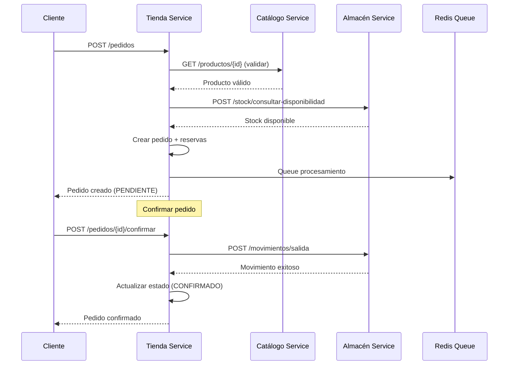
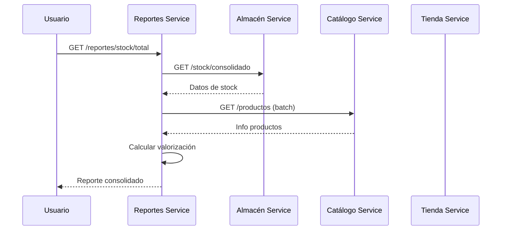

# 🌟 NutriChain - Sistema de Microservicios de Logística

NutriChain es un sistema completo de microservicios diseñado para gestionar la cadena de suministro y logística de productos alimentarios, implementando patrones de arquitectura distribuida de nivel senior.

## 🏗️ Arquitectura del Sistema

El sistema está compuesto por 4 microservicios principales que implementan el patrón de **Arquitectura de Microservicios** con comunicación por REST API y gestión de estado distribuido:

```
┌─────────────────┐    ┌─────────────────┐    ┌─────────────────┐    ┌─────────────────┐
│  Catálogo       │    │    Almacén      │    │    Tienda       │    │   Reportes      │
│  Service        │    │    Service      │    │    Service      │    │   Service       │
│  (Puerto 8000)  │    │  (Puerto 8001)  │    │  (Puerto 8003)  │    │  (Puerto 8002)  │
│                 │    │                 │    │                 │    │                 │
│ • Productos     │◄──►│ • Stock         │◄──►│ • Pedidos       │◄──►│ • Consolidación │
│ • Categorías    │    │ • Movimientos   │    │ • Clientes      │    │ • Análisis      │
│ • Validaciones  │    │ • Almacenes     │    │ • Reservas      │    │ • Trazabilidad  │
└─────────────────┘    └─────────────────┘    └─────────────────┘    └─────────────────┘
         │                       │                       │                       │
         └───────────────────────┼───────────────────────┼───────────────────────┘
                                 │                       │
                    ┌─────────────────┐    ┌─────────────────┐
                    │   PostgreSQL    │    │     Redis       │
                    │  (Puerto 5432)  │    │  (Puerto 6379)  │
                    │                 │    │                 │
                    │ • catalogo_db   │    │ • Cache         │
                    │ • almacen_db    │    │ • Colas         │
                    │ • tienda_db     │    │ • Sesiones      │
                    │ • reportes_db   │    │                 │
                    └─────────────────┘    └─────────────────┘
```

### 🎯 Patrones Arquitectónicos Implementados

- **🔄 Saga Pattern**: Transacciones distribuidas para pedidos
- **📦 CQRS Ligero**: Separación de comandos y consultas
- **🎪 API Gateway Pattern**: Gestión centralizada de rutas
- **🔒 Fail-Safe Design**: Manejo robusto de errores
- **📊 Event Sourcing**: Trazabilidad completa de operaciones
- **🚀 Async Processing**: Colas Redis para procesamiento no bloqueante

## 🛍️ Funcionalidades Principales

### 📦 Microservicio Catálogo (PHP/Symfony)

- ✅ Gestión completa de productos y categorías
- 🔍 Validaciones de unicidad y campos obligatorios
- 🖼️ Manejo de imágenes de productos
- 📊 API REST con documentación Swagger

### 🏪 Microservicio Almacén (Python/FastAPI)

- 📈 Control de stock en tiempo real
- 🔄 Gestión de movimientos (entradas/salidas/transferencias)
- 🏢 Administración de múltiples almacenes
- ⚡ Validaciones de negocio con fail-fast

### 🛒 Microservicio Tienda (Python/FastAPI)

- 👥 Gestión de clientes y pedidos
- 🔒 Sistema de reservas de stock
- 📋 Orquestación de transacciones distribuidas
- 🚚 Gestión de envíos y devoluciones

### 📊 Microservicio Reportes (Python/FastAPI)

- 📈 Consolidación de datos en tiempo real
- 📋 Reportes de stock valorizado
- 📅 Análisis de pedidos por período
- 🔍 Trazabilidad completa de productos

## 🚀 Instalación y Ejecución

### Prerrequisitos

- 🐳 Docker >= 20.10
- 🐙 Docker Compose >= 2.0
- 💾 4GB RAM mínimo
- 💽 2GB espacio en disco

### 🔧 Configuración Inicial

1. **Clonar el repositorio**

```bash
git clone https://github.com/jeremigio2706/Nutrichain-dev.git
cd nutrichain_dev
```

2. **Configurar permisos**

```bash
chmod +x manage_stack.sh
chmod +x postgres/init-multiple-dbs.sh
```

3. **Configuración inicial completa**

```bash
./manage_stack.sh setup
```

### 🏃‍♂️ Ejecución Rápida

```bash
# Levantar todo el stack
./manage_stack.sh up

# Solo construcción de imágenes
./manage_stack.sh build

# Modo desarrollo (con logs en vivo)
./manage_stack.sh dev

# Ver estado de servicios
./manage_stack.sh status

# Ver logs de todos los servicios
./manage_stack.sh logs

# Ver logs de un servicio específico
./manage_stack.sh logs tienda-service
```

### 🛑 Gestión del Stack

```bash
# Detener servicios
./manage_stack.sh down

# Reiniciar completamente
./manage_stack.sh restart

# Limpiar todo (¡CUIDADO! Elimina datos)
./manage_stack.sh clean

# Probar conectividad
./manage_stack.sh test

# Abrir herramientas de monitoreo
./manage_stack.sh monitor
```

## 🌐 Endpoints Disponibles

### 🔗 URLs de Servicios

| Servicio | URL Base | Documentación API |
|----------|----------|-------------------|
| **Catálogo** | <http://localhost:8000> | <http://localhost:8000/api/docs> |
| **Almacén** | <http://localhost:8001> | <http://localhost:8001/docs> |
| **Tienda** | <http://localhost:8003> | <http://localhost:8003/docs> |
| **Reportes** | <http://localhost:8002> | <http://localhost:8002/docs> |

### 📊 Herramientas de Monitoreo

| Herramienta | URL | Credenciales |
|-------------|-----|--------------|
| **Grafana** | <http://localhost:3000> | admin / password |
| **PostgreSQL** | localhost:5432 | user / password |
| **Redis** | localhost:6379 | (sin autenticación) |

### 🛍️ Endpoints Principales - Tienda Service

#### 👥 Gestión de Clientes

```http
POST   /api/v1/clientes              # Crear cliente
GET    /api/v1/clientes/{id}         # Obtener cliente
PUT    /api/v1/clientes/{id}         # Actualizar cliente
GET    /api/v1/clientes              # Listar clientes
```

#### 🛒 Gestión de Pedidos (Flujo Principal)

```http
POST   /api/v1/pedidos                    # Crear pedido con reserva
GET    /api/v1/pedidos/{id}               # Consultar estado de pedido
POST   /api/v1/pedidos/{id}/confirmar     # Confirmar pedido (Saga)
GET    /api/v1/pedidos                    # Listar pedidos
```

#### 🚚 Gestión de Envíos

```http
POST   /api/v1/pedidos/{id}/envio         # Crear envío
PUT    /api/v1/envios/{id}               # Actualizar envío
GET    /api/v1/envios/{id}               # Consultar envío
```

#### 🔄 Gestión de Devoluciones

```http
POST   /api/v1/devoluciones              # Solicitar devolución
PUT    /api/v1/devoluciones/{id}         # Procesar devolución
GET    /api/v1/devoluciones/{id}         # Consultar devolución
```

### 📦 Endpoints Principales - Almacén Service

#### 📊 Gestión de Stock

```http
GET    /api/v1/stock/consolidado          # Stock consolidado
GET    /api/v1/stock/producto/{id}        # Stock por producto
POST   /api/v1/stock/consultar-disponibilidad  # Validar disponibilidad
```

#### 🔄 Gestión de Movimientos

```http
POST   /api/v1/movimientos/entrada        # Registrar entrada
POST   /api/v1/movimientos/salida         # Registrar salida
POST   /api/v1/movimientos/transferencia  # Transferir entre almacenes
GET    /api/v1/movimientos                # Historial de movimientos
```

### 🛍️ Endpoints Principales - Catálogo Service

#### 📦 Gestión de Productos

```http
POST   /api/productos                     # Crear producto
GET    /api/productos/{id}                # Obtener producto
PUT    /api/productos/{id}                # Actualizar producto
GET    /api/productos                     # Listar productos
```

#### 📂 Gestión de Categorías

```http
POST   /api/categorias                    # Crear categoría
GET    /api/categorias                    # Listar categorías
PUT    /api/categorias/{id}               # Actualizar categoría
```

### 📊 Endpoints Principales - Reportes Service

#### 📈 Reportes de Stock

```http
GET    /api/v1/reportes/stock/total                    # Stock total valorizado
GET    /api/v1/reportes/stock/producto/{id}            # Stock por producto
GET    /api/v1/reportes/stock/almacen/{id}             # Stock por almacén
```

#### 📅 Reportes de Pedidos

```http
GET    /api/v1/reportes/pedidos/rango                  # Pedidos por fechas
GET    /api/v1/reportes/pedidos/cliente/{id}           # Pedidos por cliente
GET    /api/v1/reportes/pedidos/estadisticas           # Estadísticas de ventas
```

#### 🔍 Trazabilidad

```http
GET    /api/v1/reportes/trazabilidad/producto/{id}     # Trazabilidad completa
GET    /api/v1/reportes/movimientos/historico          # Histórico de movimientos
```

## 🔄 Flujos de Negocio Principales

### 🛒 Flujo de Creación de Pedido (Patrón Saga)



### 📊 Flujo de Generación de Reportes



## 🗃️ Esquema de Base de Datos

### 🏪 Tienda Database

```sql
-- Tabla principal de clientes
clientes (id, nombre, apellido, email, telefono, direccion, activo)

-- Gestión de pedidos con estados
pedidos (id, cliente_id, estado, total, fecha_creacion, fecha_confirmacion)

-- Detalles de productos en pedidos
pedido_detalles (id, pedido_id, producto_id, cantidad, precio_unitario, subtotal)

-- Sistema de reservas de stock
reservas_stock (id, pedido_id, producto_id, almacen_id, cantidad_reservada, completada)

-- Gestión de envíos
envios (id, pedido_id, estado, transportista, numero_guia, direccion_entrega)

-- Gestión de devoluciones
devoluciones (id, pedido_id, producto_id, cantidad, motivo, estado)
```

### 📦 Almacén Database

```sql
-- Gestión de almacenes
almacenes (id, nombre, direccion, tipo, activo)

-- Control de stock por producto/almacén
stock (id, producto_id, almacen_id, cantidad_actual, cantidad_minima, cantidad_maxima)

-- Histórico de todos los movimientos
movimientos (id, producto_id, almacen_id, tipo_movimiento, cantidad, motivo, fecha_movimiento)
```

## ⚙️ Configuración Avanzada

### 🔧 Variables de Entorno

Cada servicio puede configurarse mediante variables de entorno:

```bash
# Base de datos
DATABASE_URL=postgresql://user:password@db:5432/service_db

# Redis
REDIS_URL=redis://redis:6379/0

# Servicios externos
CATALOGO_SERVICE_URL=http://catalogo-service:80
ALMACEN_SERVICE_URL=http://almacen-service:8000
TIENDA_SERVICE_URL=http://tienda-service:8003

# Configuración de aplicación
DEBUG=true
LOG_LEVEL=INFO
ENVIRONMENT=development
```

### 🐳 Personalización de Docker

Para modificar la configuración de contenedores, editar `docker-compose.yml`:

```yaml
services:
  tienda-service:
    environment:
      - DATABASE_URL=postgresql://user:password@db:5432/tienda_db
      - REDIS_URL=redis://redis:6379/0
      - DEBUG=true
    ports:
      - "8003:8003"
```

## 🔍 Monitoreo y Observabilidad

### 📊 Stack de Observabilidad Incluido

- **Grafana**: Dashboards y visualizaciones
- **Loki**: Agregación de logs centralizados
- **Promtail**: Recolección de logs de contenedores
- **Logs Estructurados**: JSON logging en todos los servicios

### 📈 Métricas Disponibles

- Tiempo de respuesta de APIs
- Tasa de errores por servicio
- Throughput de transacciones
- Estado de colas Redis
- Utilización de base de datos

## 🐛 Troubleshooting

### 🔧 Problemas Comunes

1. **Servicios no responden**

```bash
./manage_stack.sh status
./manage_stack.sh logs [servicio]
```

2. **Error de conexión a base de datos**

```bash
docker-compose exec db pg_isready -U user
```

3. **Redis no disponible**

```bash
docker-compose exec redis redis-cli ping
```

4. **Puertos ocupados**

```bash
# Verificar puertos en uso
netstat -tlnp | grep :8000
```

### 🔄 Reinicio Limpio

```bash
# Detener todo y limpiar
./manage_stack.sh down
docker system prune -f
./manage_stack.sh up
```

## 🤝 Contribución

### 📋 Guías de Desarrollo

1. **Estructura de Código**: Seguir patrones establecidos en cada servicio
2. **Testing**: Implementar pruebas unitarias e integración
3. **Documentación**: Mantener OpenAPI actualizado
4. **Logs**: Usar logging estructurado con contexto

### 🔄 Workflow de Desarrollo

```bash
# Desarrollo local
./manage_stack.sh dev

# Ejecutar pruebas
./almacen-service/test_almacen_implementation.sh
./catalogo-service/run_all_tests.sh

# Validar arquitectura
python validate_senior_architecture.py
```

## 📝 Licencia

Este proyecto está bajo la Licencia MIT. Ver `LICENSE` para más detalles.

## 📞 Soporte

Para soporte técnico o preguntas sobre implementación:

- 📧 Email: <soporte@nutrichain.com>
- 📖 Documentación: Ver `/docs` en cada servicio
- 🐛 Issues: Usar GitHub Issues para reportar problemas

---

🌟 **NutriChain** - Arquitectura de Microservicios de Nivel Senior para Logística Alimentaria
